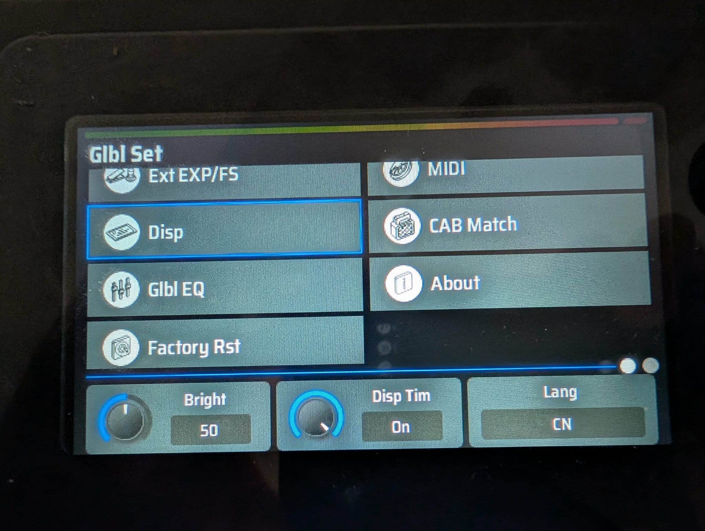

# Valeton GP-200 Firmware English Patch

This is a patch for the Chinese-only versions Valeton GP-200 to add English language support. On such units, the language cannot be switched to English regardless of what firmware is uploaded. The solution is to do string-replacements to the firmware, so that Chinese-language strings are replaced with English-language ones.

This is already [done for GP-50 by naturalfinder-os](https://github.com/naturalfinder-os/valeton-english-patch). However, unlike GP-50, GP-200 has checksumming logic for the firmware, as well as some weird handling of number strings. Since the GP-50 patch was in powershell, I also replicated GP-50 patching logic here for portability, but I haven't tested that part out.

I've only tested this with firmware version 1.8.0. Your mileage may vary.

The displayed strings don't match the official English firmware, as they have to fit in the same byte-length as the original Chinese strings, and in some cases preserve the position of numerical characters, but they're readable enough.

In the spirit of acknowledging that this is a hacky string-replacement patch rather than something that unlocks the original English-language support, I translate "中文" to "CN" rather than to "ENG". 


## Installation
`uv` must be available on the system. 
[https://docs.astral.sh/uv/getting-started/installation/](https://docs.astral.sh/uv/getting-started/installation/)

```bash
uv sync
```

## Usage

### Scanning Firmware

To extract Chinese strings from a firmware binary and generate an empty translations JSON template:

```bash
uv run poe scan firmware.bin
```

Or with a custom output filename:

```bash
uv run python3 valeton_gp200_english_patch/patch_firmware.py --scan firmware.bin --scan-output translations_custom.json
```

### Generating Translations

To fill the translations template up with pre-fitted English strings, run:

```bash
uv run poe translate translations_gp200.json
```

Or specify a custom output file:

```bash
uv run python3 valeton_gp200_english_patch/generate_translations.py input.json output.json
```

### Patching Firmware

Once you have a filled translations JSON file, apply it to create a patched firmware:

```bash
uv run poe patch -i firmware.bin -t translations_gp200.json
```

Additional options:

- `-o, --output FILE`: Specify output filename (default: `<input>-patched.bin`)
- `--device gp50|gp200|auto`: Target device (default: auto-detect)
- `--force`: Skip version validation
- `-r, --region START END`: Patch only a specific hex region
- `-v, --verbose`: Enable verbose output

Example with custom output:

```bash
uv run python3 valeton_gp200_english_patch/patch_firmware.py -i firmware.bin -o patched_firmware.bin -t translations_gp200.json
```

## Development

Run code quality checks:

```bash
poe lint        # Run linter
poe format      # Format code
poe typecheck   # Run type checker
poe test        # Run all checks
```


Since I based some parts on the GP-50, this project inherits the GPL license.
[GNU General Public License v3 (GPLv3)](LICENSE.md).

